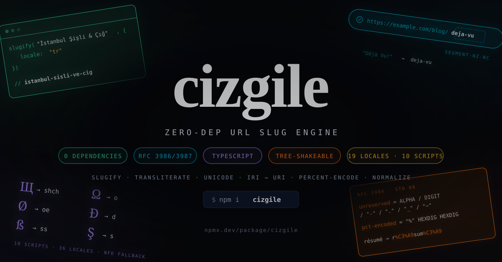

<p align="center">
  <br>
  
  <br><br>
  <b style="font-size: 2em;">cizgile</b>
  <br><br>
  Zero-dependency URL slug engine.
  <br>
  RFC 3986/3987 slugs, transliteration for seven scripts, Unicode slugs, IRI ↔ URI, percent-encoding, dot-segment removal, reference resolution. Pure TypeScript, works everywhere.
  <br><br>
  <a href="https://npmjs.com/package/cizgile"></a>
  <a href="https://npmjs.com/package/cizgile"></a>
  <a href="https://bundlephobia.com/result?p=cizgile"></a>
  <a href="https://github.com/productdevbook/cizgi/blob/main/LICENSE"></a>
</p>

## Quick Start

```sh
npm install cizgile
```

```ts
import { slugify } from "cizgile"

slugify("Hello, World!") // "hello-world"
slugify("İstanbul Şişli & Çığ", { locale: "tr" }) // "istanbul-sisli-ve-cig"
slugify("Straße Über Ärger", { locale: "de" }) // "strasse-ueber-aerger"
slugify("你好 World", { unicode: true }) // "你好-world"
```

Three entry points, each importable on its own:

| entry                   | what it holds                                                                                                 |
| ----------------------- | ------------------------------------------------------------------------------------------------------------- |
| `cizgile`               | `slugify`, `isSlug`, `truncateSlug`, `createSlugger`, `decamelize`                                            |
| `cizgile/uri`           | RFC 3986 character classes, percent-encoding, `removeDotSegments`, `resolveUri`, `normalizeUri`, RFC 3987 IRI |
| `cizgile/transliterate` | script tables, locales, `transliterate`, `defineLocale`                                                       |

`import { slugify } from "cizgile"` bundles the Latin table and symbols only; Cyrillic, Greek, Arabic,
Armenian, Georgian and Dhivehi are opt-in and tree-shake away when unused.

## `slugify(input, options?)`

Every option, with its default:

| option                      | default   | meaning                                                                                                                                           |
| --------------------------- | --------- | ------------------------------------------------------------------------------------------------------------------------------------------------- |
| `separator`                 | `"-"`     | Any string of non-alphanumerics; `""` joins words. `/`, `?`, `#`, `%` are rejected (they would break a path segment).                             |
| `lowercase`                 | `true`    | `false` keeps case (`"Donald E. Knuth"` → `Donald-E-Knuth`).                                                                                      |
| `unicode`                   | `false`   | `true` keeps every letter, digit and combining mark (Django `allow_unicode`), output in NFKC.                                                     |
| `locale`                    | —         | `"az" "da" "de" "es" "fi" "fr" "hu" "it" "nb" "nl" "pt" "sv" "tr" "vi"`, or a `Locale` object (Cyrillic locales live in `cizgile/transliterate`). |
| `transliterate`             | `true`    | `false` skips the tables (diacritics still fold); an array of tables is consulted before the Latin defaults.                                      |
| `decamelize`                | `false`   | `fooBar` → `foo-bar`, `HTMLParser` → `html-parser`, `APIs` stays.                                                                                 |
| `replacements`              | `[]`      | Literal `[from, to]` pairs applied first; surrounding spaces become separators (`["&", " and "]`).                                                |
| `remove`                    | `/['’]/g` | Global regex stripped after transliteration (`don't` → `dont`); `false` to keep.                                                                  |
| `preserveCharacters`        | `[]`      | Extra single characters allowed in the output (`["."]` keeps `v1.2.3`). May not contain the separator.                                            |
| `preserveLeadingUnderscore` | `false`   | `_foo bar` → `_foo-bar`.                                                                                                                          |
| `preserveTrailingSeparator` | `false`   | `foo bar-` → `foo-bar-` (useful while typing into an input).                                                                                      |
| `maxLength`                 | —         | Cuts at the last separator inside the limit; never mid-word unless there is no separator, never inside a surrogate pair or before a mark.         |

The pipeline, in order — the order is what makes the edge cases come out right:

1. control and format characters are dropped (tabs/newlines become spaces; ZWSP, soft hyphen, BOM, bidi marks vanish)
2. NFC, then `replacements`
3. compatibility symbols the tables know (`µ`, `™`, `№`) are mapped, then NFKC (`fi` → `fi`, `①` → `1`)
4. `decamelize`
5. transliteration: locale table → locale scripts → your tables → Latin → symbols → strip combining marks
6. lowercase (`İ` → `i`; Turkish/Azerbaijani locales use `toLocaleLowerCase("tr")` in unicode mode)
7. `remove`
8. in ASCII mode, letters no table could map are dropped (Django behaviour: `Straße` with `transliterate: false` → `strae`); runs of anything else become one separator; separators collapse and are trimmed
9. `maxLength`

Output in ASCII mode always matches `^[a-z0-9]+(-[a-z0-9]+)*$` (with the default separator) and is a
valid RFC 3986 `segment-nz-nc`, so it needs no percent-encoding. `slugify` is idempotent:
`slugify(slugify(x)) === slugify(x)`.

### Locales

Locale ids resolve to objects from `cizgile/transliterate`; you can pass those objects directly or
build your own without mutating anything global:

```ts
import { slugify } from "cizgile"
import { de, defineLocale, uk } from "cizgile/transliterate"

slugify("Київ Ґудзик", { locale: uk }) // "kyiv-gudzyk"
slugify("Fisch & Chips", { locale: de }) // "fisch-und-chips"

const swiss = defineLocale(de, { id: "de-CH", table: { ß: "ss" } })
slugify("Straße", { locale: swiss }) // "strasse"
slugify("x & y", { locale: { id: "mine", table: { "&": " plus " } } }) // "x-plus-y"
```

Non-Latin scripts without a locale:

```ts
import { cyrillic, greek } from "cizgile/transliterate"

slugify("Привет мир", { transliterate: [cyrillic] }) // "privet-mir"
slugify("Καλημέρα κόσμε", { transliterate: [greek] }) // "kalimera-kosme"
slugify("Привет мир") // "" — nothing to keep in ASCII mode
```

### Unicode slugs

```ts
import { slugify } from "cizgile"
import { iriToUri, uriToIri } from "cizgile/uri"

const slug = slugify("Ünïcödé final ①", { unicode: true }) // "ünïcödé-final-1"
const uri = iriToUri(slug) // "%C3%BCn%C3%AFc%C3%B6d%C3%A9-final-1"
uriToIri(uri) === slug // true
```

`unicode: true` keeps `\p{L}\p{N}\p{M}`, normalises to NFKC, removes bidi controls and never starts a
word with a combining mark, so `iriToUri` gives you the wire form Google asks for (UTF-8
percent-encoded) and `uriToIri` gets the slug back byte-for-byte.

### `isSlug(value, options?)`

`true` when `value` is exactly what `slugify` would have produced under the same `separator`,
`lowercase`, `unicode`, `preserveCharacters`, `preserveLeadingUnderscore`, `preserveTrailingSeparator`
and `maxLength`. Empty strings, leading/trailing/doubled separators, wrong case and non-NFKC input
are rejected.

### `createSlugger(defaults?)`

Unique slugs for a document: `foo`, `foo-2`, `foo-3`. Uniqueness is guaranteed even when a suffixed
form arrives on its own (`foo-2` after `foo-2` becomes `foo-2-2`), results stay within `maxLength`
(`foobar`, `foob-2`), the empty slug is never counted. `reset()`, `has(slug)`, `reserve(slug)`.
`slugifyWithCounter` is an alias.

### `truncateSlug(slug, maxLength, separator = "-")`

The truncation step on its own: `truncateSlug("hello-world", 8)` → `hello`.

## `cizgile/uri`

Everything here follows RFC 3986 to the letter and is checked against its test vectors (§5.4 normal
and abnormal references, §6.2 normalisation) and, where both apply, against the WHATWG `URL` parser.

| function                                                                                       | RFC               | notes                                                                                                                                                                                                                   |
| ---------------------------------------------------------------------------------------------- | ----------------- | ----------------------------------------------------------------------------------------------------------------------------------------------------------------------------------------------------------------------- |
| `isUnreserved` `isReserved` `isGenDelim` `isSubDelim` `isPchar` `isSegmentNzNc` `isQueryChar`  | 3986 §2, §3.3–3.5 | per code point                                                                                                                                                                                                          |
| `percentEncode(text, keep?)`                                                                   | §2.1, §2.5        | UTF-8, uppercase hex. `keep` is a set name (`"unreserved" "pchar" "segment-nz-nc" "path" "query" "fragment" "userinfo" "whatwg-path" "whatwg-component" "form"`) or a predicate. `%` is always encoded — input is text. |
| `percentDecode(text, { plusAsSpace })`                                                         | §2.1              | malformed `%` left alone, bad UTF-8 → U+FFFD                                                                                                                                                                            |
| `normalizePercentEncoding`                                                                     | §6.2.2.1–2        | uppercase hex, decode unreserved only                                                                                                                                                                                   |
| `encodePathSegment(seg, { noColon })` `encodePath` `encodeQuery` `encodeFragment` `encodeForm` | §3.3–3.5          | `noColon` gives `segment-nz-nc` for the first segment of a relative reference                                                                                                                                           |
| `removeDotSegments(path)`                                                                      | §5.2.4            | the literal two-buffer algorithm; `..` above the root is discarded (erratum 4547, same as WHATWG)                                                                                                                       |
| `normalizePath(path, { trailingSlash })`                                                       | §6.2.2            |                                                                                                                                                                                                                         |
| `parseUri` / `serializeUri`                                                                    | Appendix B, §5.3  | components stay distinct from "absent" (`?` vs nothing)                                                                                                                                                                 |
| `resolveUri(base, ref, { strict })`                                                            | §5.2              | strict by default (`http:g` → `http:g`); `strict: false` gives the backwards-compatible `http://a/b/c/g`                                                                                                                |
| `normalizeUri(uri, { defaultPorts })`                                                          | §6.2.2, §6.2.3    | lowercase scheme/host, percent-encoding, dot segments, default ports (`http 80` … `ftp 21`), empty path → `/`                                                                                                           |
| `isUcschar` `isIprivate` `isBidiControl` `hasBidiControls`                                     | 3987 §2.2, §4     |                                                                                                                                                                                                                         |
| `iriToUri(iri, { bidi })`                                                                      | 3987 §3.1         | NFC, then UTF-8 percent-encoding; bidi formatting characters throw (`bidi: "strip"` removes them)                                                                                                                       |
| `uriToIri(uri)`                                                                                | 3987 §3.2         | decodes only well-formed UTF-8 `ucschar`; `iprivate`, ASCII and bidi controls stay encoded                                                                                                                              |

```ts
import { normalizeUri, percentEncode, removeDotSegments, resolveUri } from "cizgile/uri"

removeDotSegments("/a/b/c/./../../g") // "/a/g"
resolveUri("http://a/b/c/d;p?q", "../../g") // "http://a/g"
normalizeUri("HTTP://www.EXAMPLE.com:80/%7e%41/./b/../c") // "http://www.example.com/~A/c"
percentEncode("À ア", "pchar") // "%C3%80%20%E3%82%A2"
```

Not implemented on purpose: RFC 6874 IPv6 zone identifiers (`[fe80::a%25en1]`) — RFC 9844 reverted
that change to the URI syntax.

## `cizgile/transliterate`

```ts
import { transliterate, cyrillic, greek, latin, symbols, locales } from "cizgile/transliterate"

transliterate("Straße Ærø") // "Strasse AEro"
transliterate("Привет", { tables: [cyrillic] }) // "Privet"
transliterate("Привет") // "Привет"  — unknown scripts are kept
transliterate("Привет", { unknown: "drop" }) // ""
transliterate("Ängsö", { locale: locales.sv }) // "Aengsoe"
```

Tables: `latin` `symbols` `cyrillic` `cyrillicUk` `cyrillicBg` `cyrillicMk` `cyrillicSr` `greek`
`arabic` `persian` `urdu` `pashto` `armenian` `georgian` `dhivehi`, plus `allScripts`. Locales:
`az bg da de es fi fr hu it mk nb nl pt ru sr sv tr uk vi` and the `locales` map. Lookup order is
locale table → locale scripts → your tables → Latin → symbols → decompose and strip marks. Table keys
are single NFC code points; a few multi-character keys (Armenian `ու`) are matched longest-first.
Where a script spells a letter differently at the start of a word (Armenian `ե`/`ո`, Ukrainian
`є ї й ю я`), the capital carries the word-initial form and the lowercase the medial one.
`defineLocale(base, overrides)` and `mergeTables(...tables)` return new objects; nothing is mutated.

## How it compares

| input                       | cizgile              | Django `slugify` | Rails `parameterize` | `@sindresorhus/slugify` |
| --------------------------- | -------------------- | ---------------- | -------------------- | ----------------------- |
| `" Joel is a slug "`        | `joel-is-a-slug`     | same             | same                 | same                    |
| `"jack & jill"`             | `jack-and-jill`      | `jack-jill`      | `jack-jill`          | `jack-and-jill`         |
| `"don't"`                   | `dont`               | `dont`           | `don-t`              | `dont`                  |
| `"fooBar"`                  | `foobar`             | `foobar`         | `foobar`             | `foo-bar`               |
| `"^très\|Jolie-- "`         | `tres-jolie`         | `tres-jolie`     | `tres-jolie`         | `tres-jolie`            |
| `"Straße"` (`locale: "de"`) | `strasse`            | `strae`          | `strasse`            | `strasse`               |
| `"5µm"`                     | `5-u-m`              | `5m`             | `5-m`                | `5-m`                   |
| `"Привет"`                  | `""` (opt-in tables) | `""`             | `""`                 | `privet`                |

`decamelize` is off by default (Django/Rails behaviour) and `&` is spelled out (sindresorhus
behaviour); both are one option away.

## Spec coverage

RFC 3986 (with errata 2033, 4547, 5428), RFC 3987, RFC 8820 (informational; no fixed prefixes are
imposed), RFC 6874 → RFC 9844 (zone ids intentionally unsupported), WHATWG URL percent-encode sets,
Google Search Central URL structure guidance. Out of scope: CJK, Hebrew, Devanagari, Thai and Hangul
transliteration — those scripts are kept in `unicode: true` and dropped in ASCII mode.

## Development

```sh
bun install
bun run test      # oxlint --type-aware, oxfmt --check, tsc --noEmit, vitest
bun run build     # rolldown → dist/*.mjs + dist/*.d.mts
bun run coverage
bun run release   # test + build, then bumpp --commit --tag --push --all; the v* tag triggers the npm publish workflow
```

Node ≥ 20.19 or any runtime with `String.prototype.normalize` and Unicode property escapes.

## Credits

cizgile stands on the shoulders of people who solved pieces of this problem first:

- [simov/slugify](https://github.com/simov/slugify) — the charmap + per-locale override idea, and most of the Cyrillic, Greek, Arabic and symbol values.
- [sindresorhus/slugify](https://github.com/sindresorhus/slugify) and [sindresorhus/transliterate](https://github.com/sindresorhus/transliterate) — `decamelize`, `customReplacements`, the counter slugger, and the Armenian, Georgian, Vietnamese and Dhivehi tables.
- [Django](https://github.com/django/django) `django.utils.text.slugify` and [Rails](https://github.com/rails/rails) `ActiveSupport::Inflector#parameterize` — the reference behaviours the parity tests are written against.
- [WHATWG URL Standard](https://url.spec.whatwg.org/) — the percent-encode sets and the parser every `cizgile/uri` result is cross-checked with.
- [RFC 3986](https://datatracker.ietf.org/doc/html/rfc3986) by Berners-Lee, Fielding and Masinter, and [RFC 3987](https://datatracker.ietf.org/doc/html/rfc3987) by Duerst and Suignard — the specifications this library exists to implement faithfully.
- [Rolldown](https://rolldown.rs), [Oxc](https://oxc.rs), [Vitest](https://vitest.dev), [Bun](https://bun.sh) and [TypeScript](https://www.typescriptlang.org) — the toolchain.

## License

MIT. Transliteration values are derived from simov/slugify and sindresorhus/transliterate (both MIT).
